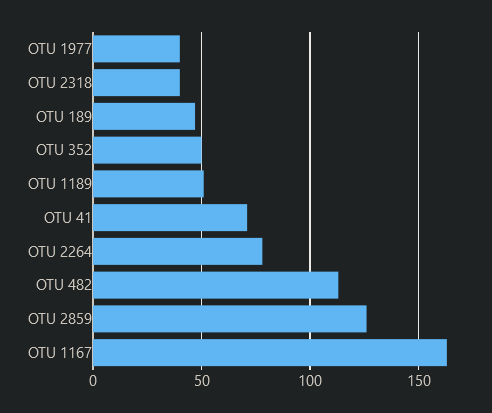
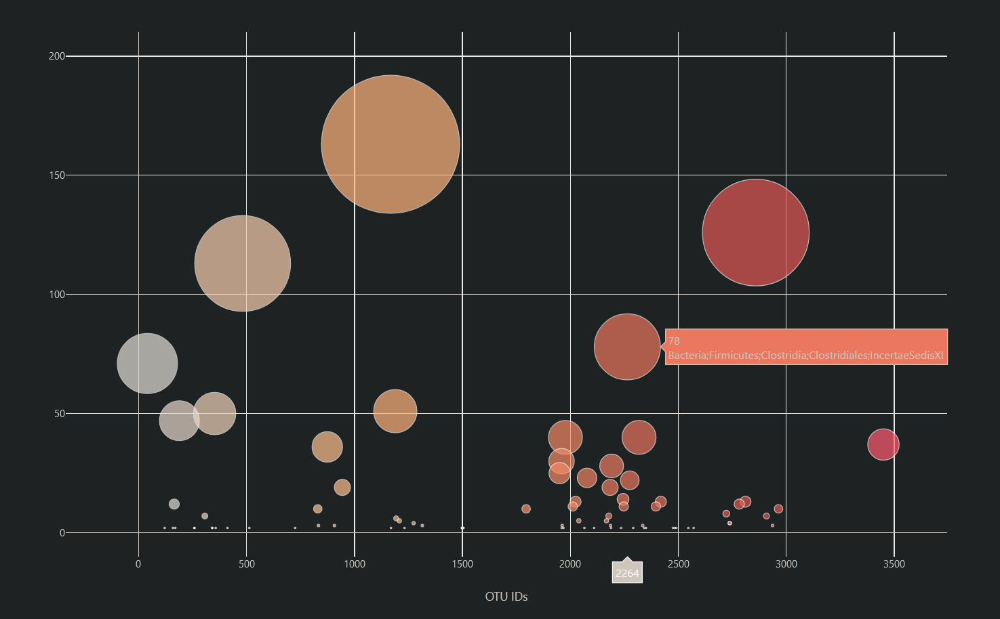
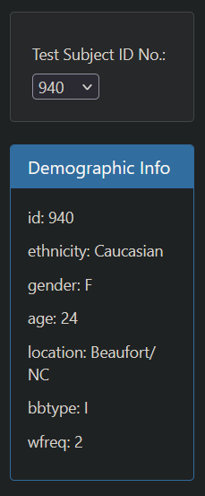
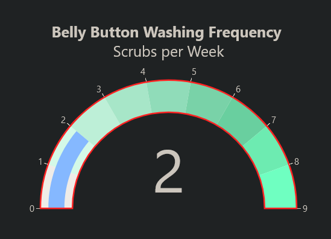

# Belly Button Biodiversity Dashboard

Deployed url: https://r-ellis-porter.github.io/belly-button-challenge/

## Overview/Purpose

The Belly Button Biodiversity Dashboard project aims to build an interactive dashboard to explore the Belly Button Biodiversity dataset, which catalogs the microbes that colonize human navels. The dataset reveals insights into the microbial species present in human navels, with some species being prevalent across a large percentage of individuals while others are relatively rare. The purpose of this project is to create visualizations that allow users to interactively explore and analyze the data to gain insights into the microbial diversity of human navels.

## Summary

This project involves creating an interactive dashboard that displays various visualizations of the Belly Button Biodiversity dataset. The dashboard includes:

- A dropdown menu to select individual test subject IDs.
- A horizontal bar chart displaying the top 10 operational taxonomic units (OTUs) found in the selected individual, based on sample values, OTU IDs as labels, and OTU labels as hover text.
- A bubble chart displaying each sample, with OTU IDs on the x-axis, sample values on the y-axis, marker size representing sample values, marker colors representing OTU IDs, and text values representing OTU labels.
- Display of sample metadata, including demographic information, for the selected individual.
- A gauge chart displaying the weekly washing frequency of the individual.

## Interactive Charts

*Horizontal bar chart displaying top 10 OTUs in a selected individual.*

*Bubble chart displaying OTU distribution across samples.*

*Selection dropdown and Metadata panel displaying demographic information of the selected individual.*

*Gauge chart displaying the weekly washing frequency of the individual.*

## Technical Details

### Files Structure

- `index.html`: HTML file containing the structure of the dashboard.
- `/static`: Directory containing static files such as CSS and JavaScript.
  - `/js`: Directory containing JavaScript files.
    - `app.js`: JavaScript file containing the logic for reading data, creating visualizations, and handling user interactions.

### Dependencies

- D3.js: A JavaScript library for manipulating documents based on data.
- Plotly.js: A JavaScript library for creating interactive plots and charts.

## Running the Code

1. Clone the repository to your local machine.
2. Open `index.html` in a web browser.

## Conclusion

The Belly Button Biodiversity Dashboard project provides an interactive platform for exploring and analyzing the microbial diversity of human navels. By visualizing the dataset through various charts and providing demographic information, the dashboard facilitates understanding of the microbial composition and its variations across individuals. Users can gain valuable insights into the prevalence and distribution of microbial species, as well as the impact of factors such as washing frequency on microbial diversity.

